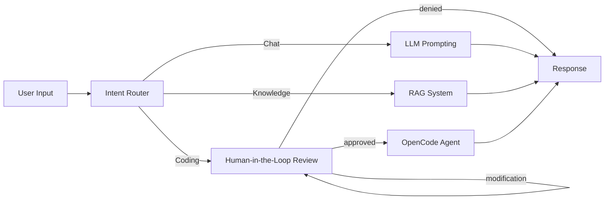

CKCagent( C for chat, K for knowledge and C for code) 

this is not a production level agent.

how it is built in steps:
  * [x] user messages
  * [x] memory : added memory using the inmemorysaver
  * [x] conditional edges : choosing between three "modes"
        1. chat 
        2. knowledge retrieval *(RAG*)
        3. coding *(using opencode, claude code is an optional swap)* with Human In Loop(HIL) + looping the HIL so that nothing is passed without approval
  * [x] fixes : safer HIL answers, revisions that keep the original request, conversation context for opencode, error handling (see [CHANGELOG.md](CHANGELOG.md))

Graph:


> NOTE: you see the changes step by step in the commit history 

> NOTE: uses custom made embedding structure(openai embedding model is paid), uses opencode(claude code is paid)

todo : 
- [x] the opencode doesnt now about the context/saved memory → the last few messages are now written into the opencode prompt
- [ ] let the agent (llm) craft the prompt for the opencode process instead of just pasting the history in
- [ ] better local retrieval: strip punctuation / stopwords in `SimpleLocalSearch` (right now `k=3` with 3 documents returns everything)
- [ ] persistent memory (SqliteSaver / PostgresSaver) instead of `InMemorySaver`

---

## What Every File Does

* **[main.py](main.py)**: The main application entry point. Houses the LangGraph tri-modal state machine agent (Chat, RAG, Code) featuring the Human-in-the-Loop approval loop.
* **[agent_till_memory.py](agent_till_memory.py)**: An earlier trial script illustrating a simple chat agent with memory (InMemorySaver) before the router and code agent were built.
* **[main_explanation.md](main_explanation.md)**: A detailed walkthrough of `main.py` explaining State, nodes, the HIL loop mechanism, and its standard Python/LangGraph imports.
* **[rag_explanation.md](rag_explanation.md)**: An educational guide breaking down RAG theory, vector embeddings, storage, retrieval types (dense vs. sparse), and prompt grounding.
* **[CHANGELOG.md](CHANGELOG.md)**: What was fixed after the first working version, why, and how it was tested.
* **[workspace/](workspace)**: Subfolder serving as the sandbox/project workspace directory where the `opencode` or `claude` execution subprocess operates.
* **.env**: Environment configuration file storing your API key and base URL (e.g. OpenRouter). Ignored by Git.
* **[.gitignore](.gitignore)**: Tells Git which files/directories to ignore (like `.env` and system files).
* **[pyproject.toml](pyproject.toml) & [uv.lock](uv.lock)**: Configuration and dependency lockfiles defining packages (like `langgraph`, `langchain`, `python-dotenv`) installed using the `uv` tool.

---

## How to Use

### 1. Prerequisites
Ensure your local `.env` file is set up with your OpenRouter credentials:
```env
OPENAI_API_BASE='https://openrouter.ai/api/v1'
OPENAI_API_KEY='your-openrouter-api-key'
```

For code mode, [OpenCode](https://opencode.ai) must be installed at `~/.opencode/bin/opencode` (or switch to the Claude Code option inside `prompt_llm_code`). If it's missing, the agent tells you instead of crashing.

### 2. Running the Agent
Start the interactive chat loop using `uv`:
```bash
uv run main.py
```

On startup it redraws `agent_graph_after_looping_with_HIL.png`. That uses the mermaid.ink web API, so offline it just prints a note and carries on.

Quit with `Ctrl+C` or `Ctrl+D`. Memory lives in RAM (`InMemorySaver`), so the conversation is gone after you quit.

### 3. Interacting with the Modes
* **Chatting (Chat Mode)**: Type anything conversational (e.g., `"hello how are you?"`). The router will detect `'chat'` and reply as a general assistant.
* **Asking about Jim Simons (RAG Mode)**: Ask queries like `"who is jim simons?"` or `"tell me about the chern simons form"`. The router will direct to `'knowledge'` and fetch matches locally from your text corpus.
* **Code Alteration (Code Mode + Human-In-The-Loop)**:
  * Ask the agent to modify code in the workspace (e.g., `"can you add hello world to the readme file?"`).
  * The graph will pause and show: `we are about to run opencode with request: ... type yes to accept, no to deny, or type a modification`
  * **To Accept:** Type one of `y`, `yes`, `approve`, `ok`, `okay`, `go`, `run`, `proceed`, `accept`. OpenCode (or Claude Code if configured) then edits the files, getting the approved request **plus the last 6 messages of the conversation** as context.
  * **To Deny:** Type one of `n`, `no`, `deny`, `disapprove`, `disallow`, `decline`, `stop`, `wait`, `dont run`, `exit`, `e`. Nothing runs.
  * **To Modify:** Type anything else (e.g., `"write it in README.md, not notes.txt"`). Your revision is **added to** the original request (it doesn't replace it, and its capitalisation is kept), and you're asked to approve the combined request again. You can revise as many times as you like.
  * An empty answer just asks again.
  * Answers are matched case-insensitively and must be the whole answer: `yes please` counts as a modification, not an approval.

### 4. When something fails
One failed turn doesn't end the session. A bad JSON answer from the classifier, a rate limit or a network error prints `Bot: something went wrong (...)` and you can keep chatting with your history intact. If OpenCode is missing, times out (600 s) or exits with an error, that is reported as the bot's reply.
