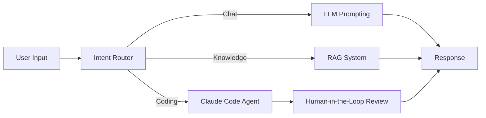

CKCagent( C for chat, K for knowledge and C for code) 

this is not a production level agent.

how it is built in steps:
  * [x] user messages
  * [x] memory : added memory using the inmemorysaver
  * [x] conditional edges : choosing between three "modes"
        1. chat 
        2. knowledge retrieval *(RAG*)
        3. coding *(using claude code)* with Human In Loop(HIL) + looping the HIL so that nothing is passed without approval

Graph:


> NOTE: you see the changes step by step in the commit history 

> NOTE: uses custom made embedding structure(openai embedding model is paid), uses opencode(claude code is paid)

todo : 
- [ ] the opencode doesnt now about the context/saved memory you let the agent craft the prompt for the opencode process

---

## What Every File Does

* **[main.py](file:///Users/chiragtaneja/Codes/repos/agent_experiments/main.py)**: The main application entry point. Houses the LangGraph tri-modal state machine agent (Chat, RAG, Code) featuring the Human-in-the-Loop approval loop.
* **[agent_till_memory.py](file:///Users/chiragtaneja/Codes/repos/agent_experiments/agent_till_memory.py)**: An earlier trial script illustrating a simple chat agent with memory (InMemorySaver) before the router and code agent were built.
* **[main_explanation.md](file:///Users/chiragtaneja/Codes/repos/agent_experiments/main_explanation.md)**: A detailed walkthrough of `main.py` explaining State, nodes, the HIL loop mechanism, and its standard Python/LangGraph imports.
* **[rag_explanation.md](file:///Users/chiragtaneja/Codes/repos/agent_experiments/rag_explanation.md)**: An educational guide breaking down RAG theory, vector embeddings, storage, retrieval types (dense vs. sparse), and prompt grounding.
* **[workspace/](file:///Users/chiragtaneja/Codes/repos/agent_experiments/workspace)**: Subfolder serving as the sandbox/project workspace directory where the `opencode` or `claude` execution subprocess operates.
* **[.env](file:///Users/chiragtaneja/Codes/repos/agent_experiments/.env)**: Environment configuration file storing your API key and base URL (e.g. OpenRouter). Ignored by Git.
* **[.gitignore](file:///Users/chiragtaneja/Codes/repos/agent_experiments/.gitignore)**: Tells Git which files/directories to ignore (like `.env`, virtual environment, and system files).
* **[pyproject.toml](file:///Users/chiragtaneja/Codes/repos/agent_experiments/pyproject.toml) & [uv.lock](file:///Users/chiragtaneja/Codes/repos/agent_experiments/uv.lock)**: Configuration and dependency lockfiles defining packages (like `langgraph`, `langchain`, `python-dotenv`) installed using the `uv` tool.

---

## How to Use

### 1. Prerequisites
Ensure your local `.env` file is set up with your OpenRouter credentials:
```env
OPENAI_API_BASE='https://openrouter.ai/api/v1'
OPENAI_API_KEY='your-openrouter-api-key'
```

### 2. Running the Agent
Start the interactive chat loop using `uv`:
```bash
uv run main.py
```

### 3. Interacting with the Modes
* **Chatting (Chat Mode)**: Type anything conversational (e.g., `"hello how are you?"`). The router will detect `'chat'` and reply as a general assistant.
* **Asking about Jim Simons (RAG Mode)**: Ask queries like `"who is jim simons?"` or `"tell me about the chern simons form"`. The router will direct to `'knowledge'` and fetch matches locally from your text corpus.
* **Code Alteration (Code Mode + Human-In-The-Loop)**:
  * Ask the agent to modify code in the workspace (e.g., `"can you add hello world to the readme file?"`).
  * The graph will pause and prompt: `we are about to run OpenCode with request: ... accept the above request to continue?`
  * **To Accept:** Type `yes` or `y`. The subprocess will trigger OpenCode (or Claude Code if configured) to edit the files.
  * **To Deny:** Type `no` or `n`. The graph will cancel execution safely.
  * **To Modify:** Type a feedback message (e.g., `"can you write hello universe instead?"`). The agent will update the instruction and loop back to request confirmation for the modified command.
```