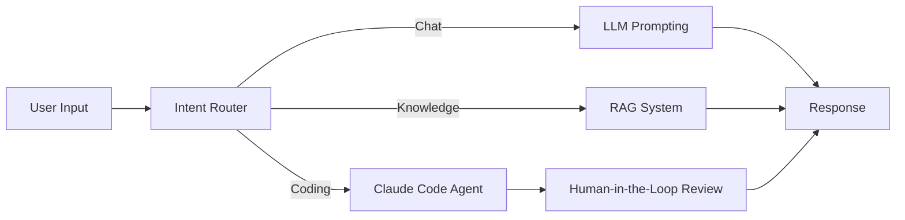

CKCagent( C for chat, K for knowledge and C for code)

how it is built in steps:
  * [x] user messages
  * [x] memory : added memory using the inmemorysaver
  * [x] conditional edges : choosing between three "modes"
        1. chat 
        2. knowledge retrieval *(RAG*)
        3. coding *(using claude code)* with Human In Loop(HIL) + looping the HIL so that nothing is passed without approval

Graph:

> NOTE: you see the changes step by step in the commit history 

> NOTE: uses custom made embedding structure(openai embedding model is paid), uses opencode(claude code is paid)

todo : [ ] the opencode doesnt now about the context/saved memory you let the agent craft the prompt for the opencode process