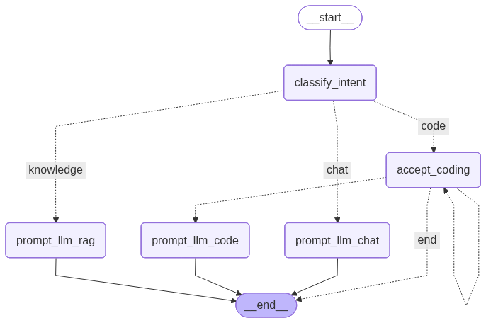

# Explaining `main.py`: Interactive Agent with HIL Loop and RAG

This document provides a detailed walkthrough of the agentic graph architecture implemented in [main.py](file:///Users/chiragtaneja/Codes/repos/agent_experiments/main.py). 

---

## 1. Graph Architecture Diagram

Below is the graph representing the state transitions of the agent system. The diagram is saved in the workspace as `agent_graph_after_looping_with_HIL.png` and represents the flow:



---

## 2. Key Components Explained

### A. Graph State Definition (`State`)
The state keeps track of the conversation and routing information across graph steps:
```python
class State(TypedDict):
    messages: Annotated[list, add_messages] # Append-only list of messages (conversation history)
    message_intent: str | None              # Intent classified by classify_intent node
    next_node: str | None                   # Destination node for HIL routing
```

* **`messages`**: Uses the `add_messages` reducer to automatically append new user inputs and assistant responses to the conversation memory.
* **`next_node`**: Stores the target node determined by the Human-In-The-Loop (HIL) check to govern conditional routing.

---

### B. Intent Classification (`classify_intent`)
This node acts as the router for incoming user messages:
* **Logic:** Uses the free LLM `z-ai/glm-4.5-air` with `with_structured_output` configured in `json_mode`.
* **Output:** Returns a JSON object with a `message_intent` matching the schema `IntentClassifier` (one of `'chat'`, `'knowledge'`, or `'code'`).
* **Conditional Routing:**
  * `'chat'` $\rightarrow$ `prompt_llm_chat`
  * `'knowledge'` $\rightarrow$ `prompt_llm_rag`
  * `'code'` $\rightarrow$ `accept_coding` (Human-in-the-loop validation)

---

### C. Human-in-the-Loop Node (`accept_coding`)
When the user asks to change code, the graph routes here first to obtain explicit authorization before executing local commands:

```python
def accept_coding(state: State) -> dict:
    user_prompt = state["messages"][-1].content
    # Triggers a LangGraph interrupt, pausing graph execution and prompting the console
    decision = interrupt(f"we are about to run OpenCode with request: {user_prompt}\n\naccept request to continue?")
    
    text = str(decision).strip().lower() 
    
    # y, yes, approve, etc.
    if text in ["yes", "approve", "go", ...]:
        return {'next_node': 'prompt_llm_code'}
    
    # n, no, deny, etc.
    if text in ['no', 'disapprove', 'deny', ...]:
        return {"messages": [{'role': 'assistant', 'content': 'Coding request denied by user.'}], 'next_node': 'denied'}

    # If the user responds with a modification, route back to accept_coding
    return {"messages": [{'role': 'assistant', 'content': text}], 'next_node': 'accept_coding'}
```

* **`interrupt()`**: Pauses the graph. In the outer loop, the script catches the interrupt, asks the user for input, and uses `Command(resume=decision)` to resume execution.
* **Revision Loop:** If the user enters a comment/modification rather than a straight Yes/No, the state transitions back to `accept_coding` to prompt validation on the revised command.

---

### D. Knowledge Retrieval Node (`prompt_llm_rag`)
Because calling standard embedding models can be expensive or trigger API payment issues, this node uses a **custom local search**:

1. **`SimpleLocalSearch`**: Scores your preloaded `KNOWLEDGE` paragraphs by checking word-overlap with the user's query.
2. **Context Assembly**: Concatenates the top 3 highest-matching paragraphs.
3. **Prompt Grounding**: Assembles a system prompt forcing the LLM to only answer using the retrieved context (or say *"I do not know"* if missing).

---

### E. Code Execution Node (`prompt_llm_code`)
Once a coding request is approved, this node runs an agent inside the designated `workspace` subdirectory:

* **OpenCode (Default):** Runs the local `opencode` binary using a subprocess:
  ```bash
  ~/.opencode/bin/opencode run "prompt" --dangerously-skip-permissions
  ```
  The `--dangerously-skip-permissions` flag is used because the code execution is already vetted and approved by you in the prior `accept_coding` phase.
* **Claude Code (Alternative):** A commented out alternative is provided using the global `claude` CLI:
  ```bash
  claude -p "prompt" --permission-mode accept-edits
  ```

---

## 3. The Execution Loop (`while True`)

The runtime loop controls how messages flow in and out of the graph and handles interrupts:

```python
while True: 
    user_input = input("User: ")
    # Run graph with new user message
    result = graph.invoke({'messages':[{'role':'user', 'content': user_input}]}, config)

    # If the graph was paused by a node calling `interrupt()`
    while '__interrupt__' in result: 
        prompt = result['__interrupt__'][0].value
        decision = input(f'{prompt}\n\nContinue? Y/N: ')
        # Resume the paused graph execution with the user's input decision
        result = graph.invoke(Command(resume=decision), config)
        
    print("Bot:", result['messages'][-1].content)
```

1. **`graph.invoke`**: Invokes the graph.
2. **`__interrupt__` Check**: If the graph is paused by `accept_coding`, the key `__interrupt__` is present in the output state.
3. **`Command(resume=decision)`**: The script asks the user for confirmation and feeds the input back to the graph state to resume from the exact node where it paused.

---

## 4. Imports & Libraries Reference

Here is a breakdown of all the libraries and packages imported in `main.py`:

### Standard Python Libraries
* **`os`**: Standard operating system interface library. Used to resolve workspace folders (`os.path.join`) and expand home directory paths (`os.path.expanduser`).
* **`uuid`**: Universal Unique Identifier generator. Used to create a random `thread_id` (`uuid.uuid4()`) for keeping conversation sessions separate in the checkpointer.
* **`subprocess`**: Python's system runner. Spawns child processes to invoke CLI agents like `opencode` or `claude code` headlessly and capture their output (`capture_output=True`).
* **`logging.RootLogger`**: (Imported but unused) Standard logging structure.
* **`typing (TypedDict, Annotated, Literal)`**:
  * `TypedDict`: Defines the schema of the LangGraph state.
  * `Annotated`: Used to attach custom metadata and reducer functions to state variables (like `add_messages` to the `messages` list).
  * `Literal`: Restricts intent types strictly to `'chat'`, `'knowledge'`, or `'code'` to prevent invalid classifications.

### Pydantic (Data Validation)
* **`BaseModel`**: The base class for defining schemas in Python. Used to declare the `IntentClassifier` structure.
* **`Field`**: Attaches metadata, default values, and semantic descriptions to schema properties, giving context to the LLM when outputting JSON.

### LangChain & OpenAI Integration
* **`load_dotenv` (`python-dotenv`)**: Parses and loads environment variables from a local `.env` file into python's runtime, providing access to `OPENAI_API_KEY` and `OPENAI_API_BASE`.
* **`init_chat_model`**: A helper function from LangChain that initializes different chat models dynamically via unified parameters.
* **`Document`**: The standard text container class inside LangChain used to store page contents and metadata, consumed by retrieval tools.

### LangGraph (State Machine Agent Framework)
* **`StateGraph`**: The constructor class to register nodes, edges, state transitions, and compile the final runnable agent.
* **`START` & `END`**: Graph boundary sentinels indicating where execution begins and ends.
* **`add_messages`**: An append-reducer function. Instead of replacing the `messages` field, it merges new messages into the existing conversation list.
* **`InMemorySaver`**: A basic checkpointer that stores graph state in RAM. This provides the agent with "short-term memory" during chat loop iterations under the same `thread_id`.
* **`interrupt`**: Halts execution at a node (useful for Human-in-the-Loop validation) and pauses until input is received.
* **`Command`**: Used outside the graph to resume from an `interrupt` boundary, feeding the user's input/decision back to the graph.

