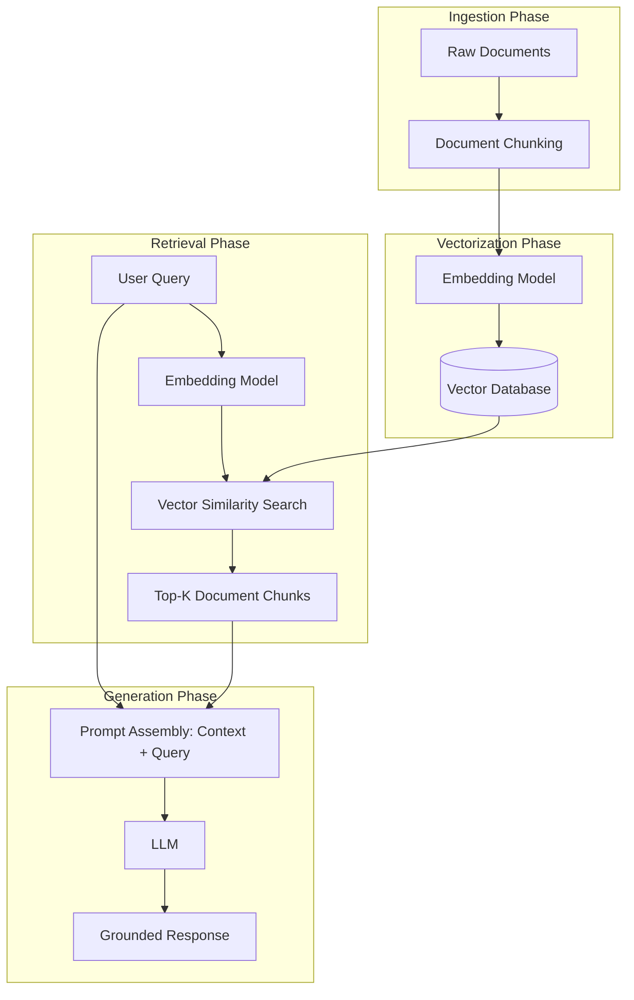

# Retrieval-Augmented Generation (RAG): A Deep Dive from First Principles

Retrieval-Augmented Generation (RAG) is a technique that enhances Large Language Models (LLMs) by dynamically retrieving relevant facts from an external data source and injecting them into the LLM's prompt. 

This document explains RAG from first principles, detailing the intuition, the underlying theory, and how each component works with concrete examples.

---

## 1. The Core Intuition: The "Open-Book Exam" Analogy

To understand RAG, think of how humans answer questions:

* **Closed-Book Exam (Standard LLM):** 
  If you take a history exam without any notes, you must rely entirely on what you memorized during training. If you forget a detail, you might guess, hallucinate, or make up facts that sound plausible. This is how a raw LLM behaves; it relies on its **parametric memory** (the weights it learned during training).
  
* **Open-Book Exam (RAG System):** 
  If you take the same exam but are given a textbook, you don't need to memorize everything. Instead, when asked a question:
  1. You look up the relevant page in the book (**Retrieve**).
  2. You read the context to verify the facts (**Augment**).
  3. You write a concise answer based *only* on that page (**Generate**).

RAG shifts the LLM's role from a **knowledge base** to a **reasoning engine**. The external database serves as the textbook, and the LLM simply synthesizes the answer.

---

## 2. First Principles: Why Do We Need RAG?

Why not just fine-tune the LLM on our data, or put everything into the prompt?

| Dimension | Fine-Tuning | Long Context Windows | RAG |
| :--- | :--- | :--- | :--- |
| **Knowledge Freshness** | ❌ Slow & expensive to retrain when data changes. | ⚠️ Must re-upload all documents on every API call. |  Instant. Just update the database. |
| **Hallucinations** | ❌ High. Hard to force a model to say "I don't know". | ⚠️ Moderate. Model can get lost in the middle of long contexts. |  Low. Hard constraints can be set via system prompts. |
| **Source Citation** | ❌ Impossible (knowledge is baked into weights). | ❌ Hard to pinpoint exact source document. |  Easy. You know exactly which chunk was retrieved. |
| **Cost & Latency** | ❌ High upfront compute costs. | ❌ High runtime costs (paying for thousands of context tokens). |  Highly efficient. You only send the most relevant snippets. |

---

## 3. The RAG Pipeline: Component-by-Component

A typical RAG pipeline consists of four major phases: **Ingestion**, **Vectorization**, **Retrieval**, and **Generation**.



---

### Phase A: Ingestion & Chunking (Preparing the Textbook)
An LLM cannot read a 500-page PDF in a split second, nor do you want to feed it the whole file. First, we must break the data down.

* **What it is:** Splitting raw documents (PDFs, Markdown files, web pages) into smaller, self-contained paragraphs called **chunks**.
* **Why it matters:** If chunks are too small, they lose context (e.g., *"He founded it in 1982"* — who is "He" and what is "it"?). If chunks are too large, retrieval accuracy drops, and LLM costs increase.
* **Strategies:**
  * **Character/Token Splitting:** Splitting every 500 characters, usually with a small overlap (e.g., 50 characters) to ensure sentences aren't cleanly cut in half.
  * **Semantic Chunking:** Splitting documents dynamically based on shifts in topic, headings, or structural delimiters (like Markdown headers `###`).

---

### Phase B: Vectorization & Embeddings (The Math of Meaning)
How does a computer search for concepts rather than literal keywords? Through **Embeddings**.

* **What it is:** An embedding model (like OpenAI's `text-embedding-3-small` or local BERT-based models) converts text into a list of numbers (a vector) of a fixed size (e.g., 1536 dimensions).
* **The Intuition (Semantic Space):**
  Imagine plotting words on a graph based on meaning:
  * The words **"King"** and **"Queen"** would be plotted very close to each other.
  * The word **"Apple"** would be far away from them, but close to **"Orange"**.
  * RAG does this in hundreds of dimensions. The vector acts as coordinates in a multi-dimensional "meaning space."

#### Mathematical Representation
If we have a Query Vector $\vec{Q}$ and a Document Chunk Vector $\vec{D}$, we calculate how close they are in semantic space using **Cosine Similarity**:

$$\text{Similarity}(\vec{Q}, \vec{D}) = \cos(\theta) = \frac{\vec{Q} \cdot \vec{D}}{\|\vec{Q}\| \|\vec{D}\|}$$

* A score of **1.0** means the vectors point in the exact same direction (perfect semantic similarity).
* A score of **0.0** means they are orthogonal (entirely unrelated).

---

### Phase C: Storage & Indexing (Vector Databases)
Once documents are vectorized, they are stored in a database optimized for multidimensional spatial searches (e.g., Pinecone, Chroma, pgvector, or `InMemoryVectorStore`).

* **Exhaustive Search (KNN):** Calculating similarity between the query and *every single document* in the database. This is what `InMemoryVectorStore` does. It is perfectly accurate but becomes slow as the database grows to millions of documents.
* **Approximate Nearest Neighbors (ANN):** Using indexing algorithms (like HNSW - Hierarchical Navigable Small World) to group similar vectors into clusters, allowing sub-millisecond retrieval across billions of vectors.

---

### Phase D: Retrieval (Finding the Best Chunks)
When a user asks a question:
1. The user's query is converted into a vector using the **same** embedding model.
2. The system queries the Vector DB to find the **Top-K** vectors with the highest Cosine Similarity to the query.

#### Dense vs. Sparse Retrieval
Your experiments demonstrate both styles of retrieval:

1. **Dense Retrieval (Vector Search / OpenAIEmbeddings):**
   * Finds concepts even if they use different words.
   * *Example:* Query: `"Who is the creator of Renaissance Technologies?"` matches Document: `"Simons founded Renaissance Technologies"`. The model understands that "creator" and "founded" are semantically identical.
   
2. **Sparse Retrieval (Keyword Search / BM25 / SimpleLocalSearch):**
   * Matches exact keywords, taking frequency and rarity into account.
   * *Example:* Query: `"Chern-Simons form"` matches Document: `"Simons developed the Chern-Simons form"`. It excels at finding exact technical terms, serial numbers, or code identifiers.

---

### Phase E: Generation (Augmenting the Prompt)
Once the Top-K chunks are retrieved, they are combined with the user's question into a template and sent to the LLM.

#### Example Prompt Construction:
```text
System: 
You are a helpful assistant. Use ONLY the following context to answer the user's question. 
If the answer cannot be found in the context, respond with "I do not know".

Context:
[Document Chunk 1] James Harris Simons was the founder of Renaissance Technologies...
[Document Chunk 2] Simons developed the Chern-Simons form...

User Question:
Who founded Renaissance Technologies?
```

Because of the strict system instructions, the LLM reads the context, extracts `"James Harris Simons"`, and answers accurately, preventing it from hallucinating or guessing.

---

## 4. Comparing the Implementations in `main.py`

In your codebase, we set up two different retrieval pipelines:

### 1. The Vector-Based Approach (Paid API Credits)
This uses deep-learning models hosted in the cloud to calculate vector coordinates.

```python
# Generates dense vectors (1536 floats) using OpenAI's neural network API
embeddings = OpenAIEmbeddings(model='text-embedding-3-small')

# Stores vectors in-memory and performs Cosine Similarity search
vector_store = InMemoryVectorStore(embeddings)
```
* **Pros:** Highly semantic; understands synonyms, metaphors, and cross-lingual meaning.
* **Cons:** Requires paid API tokens and network requests.

---

### 2. The Custom Keyword Approach (Free & Local)
This uses pure python algorithms to search for token overlaps.

```python
class SimpleLocalSearch:
    def similarity_search(self, query: str, k: int = 3) -> list[Document]:
        # Convert query to lowercase words
        query_words = set(query.lower().split())
        scored_docs = []
        for doc in self.documents:
            # Convert document to lowercase words
            doc_words = doc.page_content.lower().split()
            # Calculate intersection (simple overlap count)
            overlap = sum(1 for word in query_words if word in doc_words)
            scored_docs.append((overlap, doc))
        # Return documents sorted by highest overlap
        scored_docs.sort(key=lambda x: x[0], reverse=True)
        return [doc for score, doc in scored_docs[:k]]
```
* **Pros:** 100% free, runs entirely offline, lightning-fast, and has zero heavy external dependencies (no PyTorch/TensorFlow).
* **Cons:** Cannot match synonyms (e.g., if query has "founder" and document has "creator", it won't match unless the words physically overlap).
